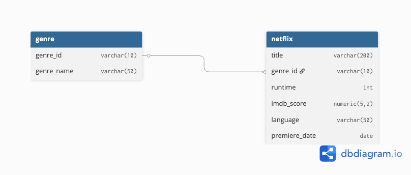

# 🎬 Netflix Originals Data Analysis: Exploring Trends and Insights  

## 📌 Overview  
This project analyzes the **Netflix Originals dataset** to extract meaningful insights and identify viewing/content trends. Using **PostgreSQL**, the project demonstrates how SQL can be leveraged for data analysis, reporting, and decision-making support.  

The project covers:  
- Database schema design and ERD creation  
- Writing efficient SQL queries for analysis  
- Exploring patterns in Netflix Original shows and movies  
- Deriving insights that can help understand Netflix’s content strategy  

---

## 🗂 Project Structure  

Netflix-Originals-Analysis/

- data/ # Sample dataset (CSV/SQL dump)
- scripts/ # SQL queries (schema, analysis, transformations)
- docs/ # Documentation (ERD, Project Details)
- README.md # Project overview

---

## 🛠️ Tools & Technologies  
- **Database**: PostgreSQL  
- **SQL Concepts Used**:  
  - `GROUP BY`, `HAVING`, `ORDER BY`, `LIMIT`  
  - `JOINS`  
  - `WINDOW FUNCTIONS`  
  - `SUBQUERIES`  

---

## 📂 Dataset  
- **Source**: Provided as part of the Internshala SQL project  
- **Description**: Contains details about Netflix Originals including:  
  - `title` – Name of the movie/show  
  - `genre` – Genre of the content  
  - `premiere_date` – Date the content premiered on Netflix  
  - `language` – Original language of the content  
  - `runtime` – Duration of the movie/show  
  - `imdb_score` – IMDb rating of the title  

---

## 🏗️ Database Design  
- The dataset was modeled into a relational structure in PostgreSQL.  
- Normalization was applied to reduce redundancy and improve query performance.  
- **Entity-Relationship Diagram (ERD):**  
    

---

## 🔍 Key SQL Queries  
Some of the important analyses performed:  
1. **Top genres by number of titles**  
2. **Languages with the highest number of Originals**  
3. **Yearly trend of Netflix Originals release**  
4. **Highest-rated Netflix Originals (IMDb)**  
5. **Distribution of runtime across movies and shows**  
6. **Ranking titles using window functions (e.g., Top 5 per genre)**  
7. **Identifying duplicate or similar entries using subqueries**  

---

Acknowledgments

Dataset provided by Internshala SQL project

Tools: PostgreSQL, dbdiagram.io (for ERD)
